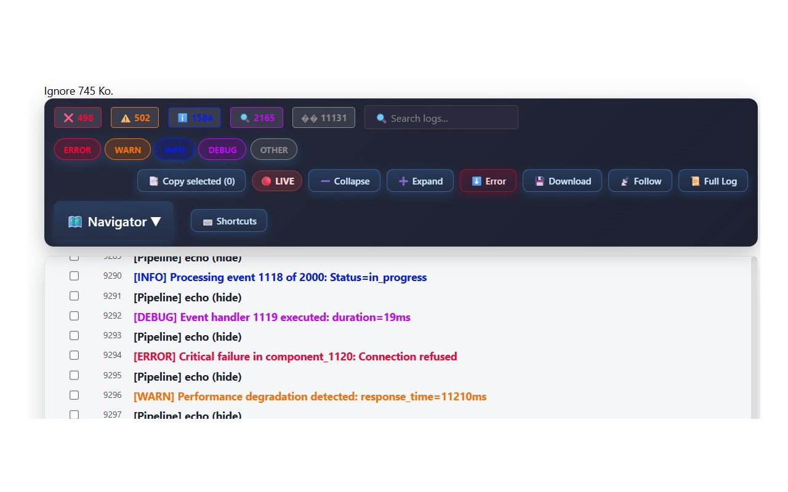
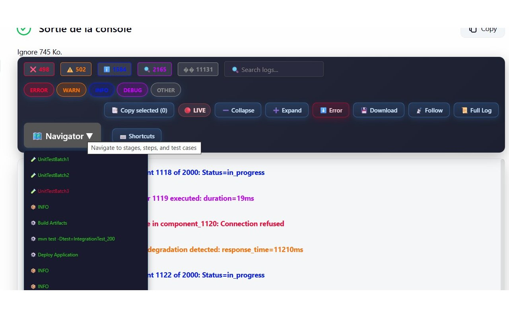
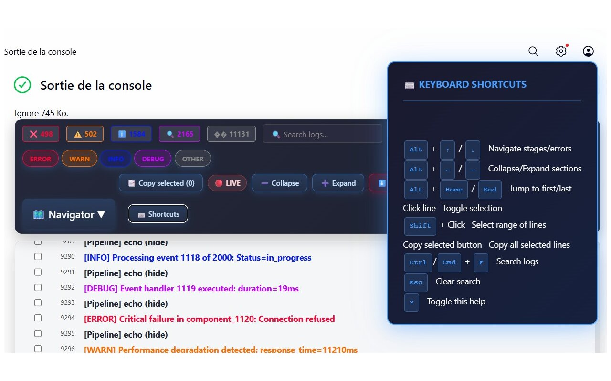

# JenkinsLogParser

[](https://chromewebstore.google.com/detail/log-parser-for-jenkins/hndknmcekdaidpgippdcaidggjeoemgg)
[](https://chromewebstore.google.com/detail/log-parser-for-jenkins/hndknmcekdaidpgippdcaidggjeoemgg)

A Chrome extension to parse Jenkins console logs with enhanced readability.

<details>
<summary>📸 Screenshots</summary>

## Main Interface



## Navigator



## Keyboard Shortcuts



</details>

## Features

### 🎨 Log Colorization

Color-codes log lines by severity:

-   🔴 **ERROR** (red)
-   🟠 **WARN** (orange)
-   🔵 **INFO** (blue)
-   🟣 **DEBUG** (purple)

### 📊 Stats Summary

Shows count of errors, warnings, info, and debug messages at a glance.

### 🔍 Search

-   Real-time search with highlighting
-   Press `Enter` to jump between matches
-   Keyboard shortcut: `Cmd/Ctrl + F`

### 🎚️ Severity Filters

Toggle visibility of log levels with filter buttons.

### 📍 Line Numbers

Every log line is numbered for easy reference.

### 📋 Copy Line

Hover over any line and click 📋 to copy it to clipboard.

### ⬇️ Jump to First Error

One-click navigation to the first error in the log.

### ➖ Collapse/Expand

Hide DEBUG and INFO lines to focus on errors and warnings.

### 🗺️ Navigator (Stages, Steps & Tests)

Dropdown menu for quick navigation between:

-   **Pipeline stages** (🔦 icon)
-   **Pipeline steps** (⚙️ icon)
-   **Test cases** (🧪 icon)

Automatically detects multiple patterns including:

-   Jenkins Pipeline stages (`[Pipeline] stage`)
-   Test frameworks (JUnit, Maven, Gradle)
-   Custom test markers
-   Generic step markers

### 💾 Download Logs

One-click download of the console output as a text file.

### 🛡️ Safe Full Log Loader

-   Replaces Jenkins' native "Full Log" link with a streaming loader that fetches `consoleFull` output in manageable chunks, keeping the browser responsive.
-   Provides a fallback link to open Jenkins' `consoleText` view in a new tab when needed.

### 🔐 HTTPS Support

Works on both HTTP and HTTPS Jenkins instances.

## Installation

1. Clone or download this repository
2. Open Chrome and navigate to `chrome://extensions/`
3. Enable "Developer mode" (toggle in top right)
4. Click "Load unpacked" and select the extension folder

## Testing

### Automated Tests (Jest)

The project includes a comprehensive Jest test suite covering utility functions and integration tests.

```bash
# Install dependencies
npm install

# Run tests
npm test

# Run tests in watch mode
npm run test:watch

# Run tests with coverage
npm run test:coverage
```

### Manual E2E Testing (Optional)

For end-to-end testing with a real Jenkins instance, see [tests/docker/README.md](tests/docker/README.md).

The Docker setup includes a `demo-patterns` pipeline job that showcases all supported log pattern types:

-   Pipeline stages (`[Pipeline] stage`)
-   Test cases (original `Starting TestCase:` format)
-   Maven/Gradle tests (`Running com.example.Test`)
-   JUnit tests (`Test: testName`)
-   Shell commands (`+ kubectl apply`)

This is a great way to see all features in action before deploying the extension.

## Notes

-   Uses **Manifest V3** (Chrome's latest extension format)
-   Runs when the page loads completely
-   Navigator automatically detects various Jenkins log patterns (stages, steps, test cases)
-   Supports custom patterns through regex-based detection
-   Works best with logs under 10MB

## Changelog

### v0.4.0 - 2026-01-18

-   Added multi-line selection with Shift-click ranges and a "Copy selected" action; shortcuts help now documents the new workflow.
-   UI polish: solid gradient toolbar, lighter log container, pill-style filters/actions, slimmer scrollbar, and pill live indicator.
-   Logs now stay inside a dedicated scrollable container so the toolbar never overlaps; initial parsing shows a spinner.
-   Removed the raw `consoleText` fallback link while keeping the safe full-log loader.

### v0.3.2 - 2026-01-05

-   Added coverage for Jenkins `/job/*/log` endpoints so the parser loads on direct log views.
-   Introduced an auto-follow toggle that keeps live builds pinned to the newest log lines unless the user scrolls away.
-   Implemented adaptive chunked rendering for huge logs to keep the browser responsive when loading or streaming massive console output.
-   Added a safe "Full Log" loader that hides Jenkins' native link, streams the entire log in chunks, and exposes a fallback raw log link.

### v0.3.1 - 2025-12-30

-   No changes listed

### v0.3.0

-   **Search** - Real-time search with highlighting and keyboard navigation
-   **Severity Filters** - Toggle visibility of ERROR, WARN, INFO, DEBUG levels
-   **Stats Summary** - Error/warning/info/debug count displayed in toolbar
-   **Line Numbers** - Every log line is numbered
-   **Copy Line** - Click to copy any log line to clipboard
-   **Jump to First Error** - One-click navigation to first error
-   **Collapse/Expand** - Hide verbose DEBUG and INFO lines
-   **Keyboard Shortcuts** - Cmd/Ctrl+F for search, Escape to clear
-   Enhanced UI with modern dark theme toolbar

### v0.2.0

-   Migrated to Manifest V3
-   **Removed jQuery dependency** - Now uses vanilla JavaScript (~90KB smaller)
-   Added HTTPS support
-   Fixed XSS vulnerability by escaping HTML in log content
-   Improved performance with batch DOM updates
-   Removed unused permissions
-   Modern ES6+ syntax with IIFE pattern
-   Code cleanup and formatting

### v0.1.0

-   Initial release

## Privacy Policy

**Log Parser for Jenkins** respects your privacy:

-   ✅ **No data collection** - This extension does not collect, store, or transmit any personal data
-   ✅ **No analytics** - No tracking or usage analytics
-   ✅ **No external connections** - All processing happens locally in your browser
-   ✅ **No remote code** - All code is bundled within the extension
-   ✅ **Minimal permissions** - No extra permissions required; the extension's content script runs only on Jenkins console pages

The extension only reads the Jenkins console output on the current page to colorize and enhance the log display. No data ever leaves your browser.

**Contact:** For questions about this privacy policy, please open an issue on the [GitHub repository](https://github.com/Esysc/JenkinsLogParser/issues).
